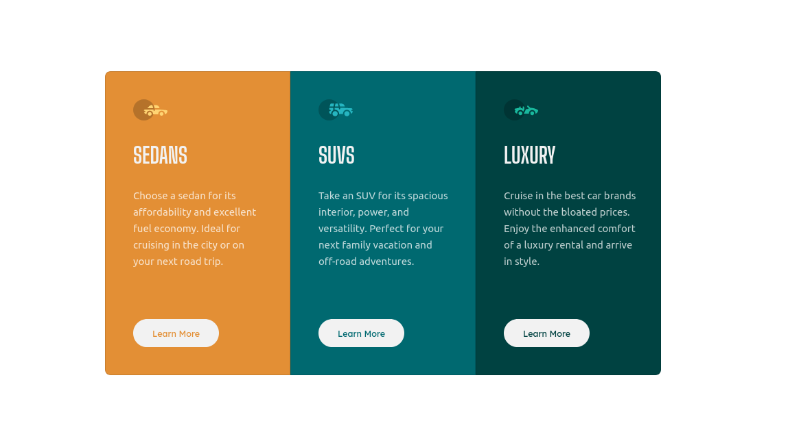

# Frontend Mentor - 3-column preview card component solution

This is a solution to the [3-column preview card component challenge on Frontend Mentor](https://www.frontendmentor.io/challenges/3column-preview-card-component-pH92eAR2-). Frontend Mentor challenges help you improve your coding skills by building realistic projects. 

## Table of contents

- [Overview](#overview)
  - [The challenge](#the-challenge)
  - [Screenshot](#screenshot)
- [My process](#my-process)
  - [Built with](#built-with)
  - [What I learned](#what-i-learned)
  - [Continued development](#continued-development)
  - [Useful resources](#useful-resources)
- [Author](#author)


## Overview

### The challenge

Users should be able to:

- View the optimal layout depending on their device's screen size
- See hover states for interactive elements

### Screenshot



## My process

This time I decided to start using Boostrap and SCSS preprocessor.
I started by installing Boostrap using NPM `npm install bootstrap` and adding the correspoding link to HTML.
Then I installed SCSS and configured my scripts in `package.json` using the following commands:

```json
"build-css": "node-sass --include-path scss scss/main.scss public/css/main.css",
"watch-css": "nodemon -e scss -x \"npm run build-css\""
```
Then I started by structuring the HTML file and creating variables in SCSS before starting to styling the page

### Built with

- Semantic HTML5 markup
- CSS custom properties
- Boostrap 
- Flexbox
- Mobile-first workflow
- SCSS

### What I learned

I learned to install Bootstrap and SCSS using npm, I also learnt how to make a simple sass compiler and watcher only using npm scripts.
I created my first variables in SCSS and used BEM methodology with SASS that is a perfect match.
I also learnt how to make a responsive web design using Bootstrap classes

Using Bootstrap to make the card component responsive

```html
<div class="container d-flex flex-column justify-content-center align-items-center flex-xxl-row">
```
in CSS I found this way to use `rem` more easy
1rem -> 10px
1.5rem -> 15px
2rem -> 20px

```css
html {
  font-size: 62.5%  
}
```
using `nth-child(n)` CSS pseudo-class to select based on their position amoung a group of siblings and

```css
.card:nth-child(2) {
  ...
}
```

`inline-size` property to defines the horizontal size of an element's block.

```css
.card__text {
  inline-size: 220px;
}
```

### Continued development

I want to improve my SCSS and Bootstrap skills, and when I feel comfortable using React I will come again an create a new branch using Git to update this card component.

### Useful resources

- [Watch and Compile your SASS](https://medium.com/@brianhan/watch-compile-your-sass-with-npm-9ba2b878415b) - This article helped me to Install and configure SASS environment.
- [BEM and SASS](https://andrew-barnes.medium.com/bem-and-sass-a-perfect-match-5e48d9bc3894) - You can read this article to implement BEM methodology with SASS

## Author

- Frontend Mentor - [@tamerlantian](https://www.frontendmentor.io/profile/tamerlantian)
- Twitter - [@2301_ian](https://twitter.com/2301_ian)

